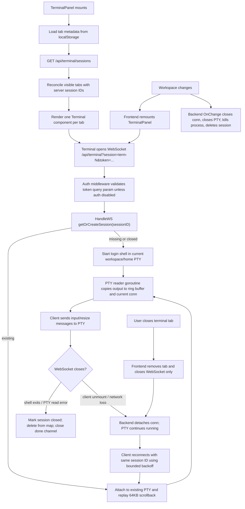

# Ticket 6: Terminal and WebSocket Lifecycle Audit

## Scope

Audited PTY session management, WebSocket reconnect behavior, auth/origin policy, cleanup behavior, workspace switching, and terminal tab ergonomics.

Primary files reviewed:

- `wede/backend/internal/terminal/terminal.go`
- `wede/src/components/Terminal.jsx`
- `wede/src/components/TerminalPanel.jsx`
- `wede/src/components/TerminalToolbar.jsx`
- `wede/src/components/IDE.jsx`

Supporting files reviewed:

- `wede/backend/internal/auth/auth.go`
- `wede/backend/internal/workspace/workspace.go`
- `wede/backend/cmd/wede/main.go`

No source changes were made.

## Commands Run

- `pwd`
- `rg --files wede | rg '(^|/)(terminal\.go|Terminal\.jsx|TerminalPanel\.jsx|TerminalToolbar\.jsx|IDE\.jsx)$'`
- `git status --short`
- `sed -n '1,260p' wede/backend/internal/terminal/terminal.go`
- `sed -n '260,520p' wede/backend/internal/terminal/terminal.go`
- `sed -n '1,280p' wede/src/components/Terminal.jsx`
- `sed -n '1,280p' wede/src/components/TerminalPanel.jsx`
- `sed -n '1,260p' wede/src/components/TerminalToolbar.jsx`
- `sed -n '1,760p' wede/src/components/IDE.jsx`
- `rg -n "terminal|HandleWS|ListSessions|New\(|auth|token|CheckOrigin|OnChange|workspace" wede/backend wede/src -g '!node_modules'`
- `rg -n "terminal" wede/backend -g '*_test.go'`
- `sed -n '1,230p' wede/backend/internal/auth/auth.go`
- `sed -n '1,150p' wede/backend/internal/workspace/workspace.go`
- `sed -n '1,120p' wede/backend/cmd/wede/main.go`
- `nl -ba ...` for line-referenced inspection of the audited files
- `cd wede/backend && go test -race ./...`

Result: `go test -race ./...` passed. All backend packages currently report `[no test files]`.

## Lifecycle Diagram

## Findings Table

| ID | Severity | Area | Finding | Evidence | Recommendation |
| --- | --- | --- | --- | --- | --- |
| F1 | High | Resource cleanup / UX contract | Closing a terminal tab detaches the WebSocket but leaves the PTY alive. This may be intended persistence, but the UI uses an `X` close affordance and removes the tab from local state, so the user-visible expectation is likely "close/kill". The next panel mount can resurrect the session as an "orphan" tab. | `TerminalPanel.closeTerminal` only removes frontend metadata at `TerminalPanel.jsx:86-98`; unmount cleanup closes only WebSocket at `Terminal.jsx:132-140`; backend read error explicitly detaches and keeps PTY alive at `terminal.go:271-281`; reconciliation re-adds server-only `term-*` sessions at `TerminalPanel.jsx:49-70`. | Define separate actions: "Close/Kill" terminates PTY through an authenticated API; "Detach/Hide" keeps PTY running and labels it as persistent. Until then, tab `X` should not silently create hidden running shells. |
| F2 | High | Resource limits | Authenticated clients can create unbounded PTY sessions by choosing new session IDs. Each session starts a shell, PTY, reader goroutine, ping goroutine per active connection, and 64KB ring buffer. There is no max sessions, idle TTL, session ID validation, or per-user/workspace quota. | Any `session` query value reaches `getOrCreateSession` at `terminal.go:206-213`; new sessions are always created at `terminal.go:116-157`; list exposes only IDs but does not limit them at `terminal.go:184-197`. | Add bounded policy: validate session IDs, cap sessions per browser/workspace, enforce idle TTL for detached PTYs, and provide explicit kill-all/session reap on logout or server shutdown if needed. |
| F3 | Medium-High | WebSocket security | `CheckOrigin` allows all origins. Auth middleware still protects the endpoint when auth is enabled, but the token is passed in the WebSocket query string and auth-disabled mode exposes terminal creation to any origin that can reach the server. | `CheckOrigin: return true` at `terminal.go:18-20`; query token fallback in auth middleware at `auth.go:172-176`; frontend sends token in query string at `Terminal.jsx:70-72`; auth-disabled bypass at `auth.go:167-170`. | Restrict origins to same host or configured dev origins. For production-ish usage, prefer a short-lived WS ticket or same-origin cookie/header-compatible upgrade path over long-lived tokens in URLs. Clearly document auth-disabled as local-only. |
| F4 | Medium | Workspace switch reliability | Workspace switch cleanup is directionally correct but not fully synchronized. It closes the PTY and kills the process while the reader goroutine may also mark closed/delete/close `done`; `done` is closed only from the reader goroutine, so ping goroutines rely on connection mismatch or eventual read failure. There is no `Wait`/reap path visible after `Process.Kill`. | Workspace callback closes conn/PTMX and kills process at `terminal.go:98-111`; reader goroutine also closes `done` and deletes map at `terminal.go:163-172`; workspace manager calls listeners after switching current workspace at `workspace.go:78-85`; frontend increments `terminalKey` before POST callback completion at `IDE.jsx:190-195`. | Centralize terminal termination in one idempotent `closeSession(reason)` method using `sync.Once`, close `done` there, close conn/PTMX, kill and wait/reap process, then delete from map. Ensure frontend waits for successful workspace-open response before creating replacement terminals. |
| F5 | Medium | Reconnect behavior | Reconnect delay is capped at 10s but never reset after a successful reconnect. A user who experiences a long outage will keep future reconnects at the higher delay even after the terminal becomes healthy. There is also no visible offline/reconnecting status. | `reconnectDelay` grows in `scheduleReconnect` at `Terminal.jsx:103-110`; `onopen` does not reset it at `Terminal.jsx:76-82`; errors are swallowed at `Terminal.jsx:92`. | Reset delay to 1000ms on `onopen`, add jitter, keep cap, and expose lightweight connection state in the tab or toolbar. |
| F6 | Medium | Data races / locking | `len(s.buf.data)` is read without taking the ring buffer mutex in a log path. The race test did not exercise this because there are no tests. | `terminal.go:121` reads `s.buf.data`; ring buffer protects `data` in `Write` and `Bytes` at `terminal.go:72-87`. | Add a `Len()` method on `ringBuffer` or remove the byte count from the log. Cover reconnect under `go test -race`. |
| F7 | Low-Medium | Protocol robustness | Text messages that are not valid resize JSON are written to the PTY. That is fine for xterm input, but it means malformed control JSON becomes shell input. Resize dimensions are not bounds-checked before conversion to `uint16`. | Resize parse/write path at `terminal.go:283-298`. | Use an explicit message envelope or binary-only input plus JSON-only control channel. Validate cols/rows to a sane range before `pty.Setsize`. |
| F8 | Low-Medium | Mobile ergonomics | Mobile has useful special keys and a command input, but Ctrl handling only works for letter-like key labels; the command input sends whole lines and cannot easily interleave editing with terminal state. There is no visible connection state, close/kill distinction, or per-tab status. | Toolbar keys at `TerminalToolbar.jsx:4-28`; Ctrl logic at `TerminalToolbar.jsx:37-53`; command submit at `TerminalToolbar.jsx:55-62`; mobile placement at `IDE.jsx:359-361`. | Keep toolbar, but add connection/session status and explicit close semantics. Consider a sticky key mode for Ctrl/Alt and a clearer distinction between raw terminal keyboard focus and "send command" line mode. |

## Behavior Contract

Recommended terminal behavior contract:

1. Session creation
   - Creating a tab creates exactly one PTY session with a validated server-owned ID.
   - Session count is bounded per browser/user/workspace.
   - New sessions start in the current workspace; if no workspace is open, either block with a visible message or intentionally start in home and label that behavior.

2. Reattach and persistence
   - Short disconnects, page reloads, and network loss detach the WebSocket while preserving the PTY for a bounded idle window.
   - Reattach with the same session ID reuses the PTY and replays bounded scrollback.
   - Detached sessions are visible as "running/detached" tabs or in a session picker; they should not be surprising hidden resources.

3. Close, detach, and kill
   - "Close" in the tab UI should kill the PTY unless the UI explicitly says "Detach".
   - If persistence is desired, provide separate user-visible actions:
     - Hide/Detach: closes the WebSocket and leaves the PTY running for reconnect.
     - Kill/Close: terminates PTY, removes ring buffer, deletes session, and removes tab metadata.
   - Closing the final visible terminal should either kill it and create a fresh idle tab, or prompt/communicate that the current PTY will keep running.

4. Workspace switch
   - Switching workspace terminates all existing terminal sessions before replacement terminals connect to the new workspace.
   - The user-visible expectation should be explicit: "Switching folders stops running terminals."
   - Backend cleanup should be idempotent and wait/reap child processes.

5. Reconnect
   - Reconnect backoff starts near 1s, caps around 10s, includes jitter, and resets after a successful connection.
   - Reconnect stops on intentional kill/close and continues only on detach/network failures.
   - UI exposes "connected", "reconnecting", and "detached/killed" states.

6. Security
   - WebSocket upgrades are same-origin by default, with explicit dev-origin allowances.
   - Query-token auth is treated as compatibility/dev behavior; prefer short-lived WS tickets or another less loggable credential path.
   - Auth-disabled mode is local-trust only and should not accept arbitrary cross-origin terminal access.

## Tests To Add

- Backend unit/integration tests for `getOrCreateSession`: create, list, reattach same ID, reject invalid IDs, enforce max sessions.
- Backend lifecycle test for intentional kill: API kills PTY, removes session from list, reader goroutine exits, child process is reaped.
- Backend race test for concurrent PTY output, reconnect, list, and workspace switch.
- Backend workspace switch test: existing sessions are terminated and cannot be reattached after switch.
- Backend auth/origin tests: unauthorized WS rejected; cross-origin WS rejected unless configured; auth-disabled policy documented/covered.
- Frontend tests for tab close semantics: close-kill removes server session; detach preserves and labels it; final tab behavior is explicit.
- Frontend tests for reconnect backoff: schedules, caps, clears on unmount, resets after open, stops after intentional close.
- Frontend mobile tests for toolbar send behavior: Ctrl keys, arrows, command history, and active-tab routing.

## Followups / Ambiguities

- Should tab `X` mean "kill this shell" or "hide/detach this shell"? Recommendation: make `X` kill, and add an explicit detach/hide action only if persistent terminals are a product goal.
- How long should detached PTYs live after reload/network loss? Recommendation: bounded idle TTL, for example 15-30 minutes, with visible status and a manual kill-all.
- Should terminal sessions survive browser logout? Recommendation: no, unless there is an explicit detached session model.
- Should terminal IDs be client-selected? Recommendation: no; server should allocate opaque IDs and map them to authenticated users/workspaces.
- Is auth-disabled intended for localhost only? Recommendation: document and enforce local-only binding or strict same-origin behavior when disabled.
- Should opening a new workspace always stop running terminals? Recommendation: yes, with a visible expectation in the folder switch flow because commands may be running.
